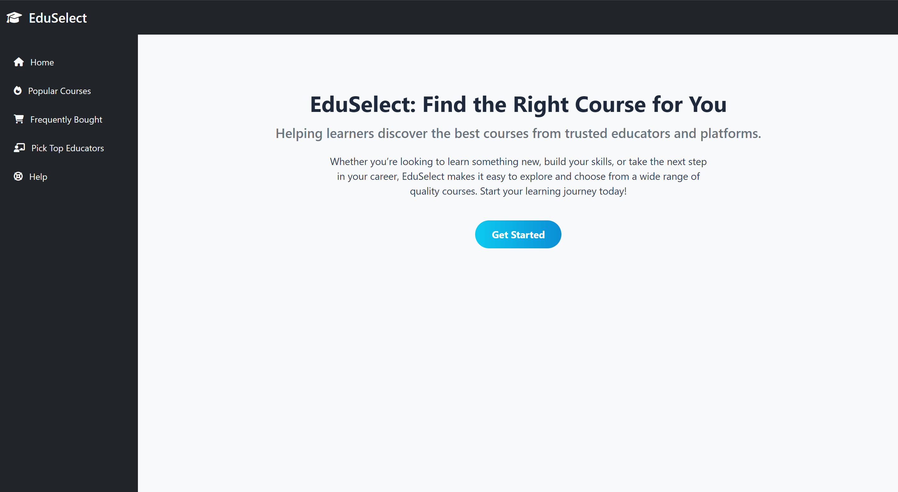
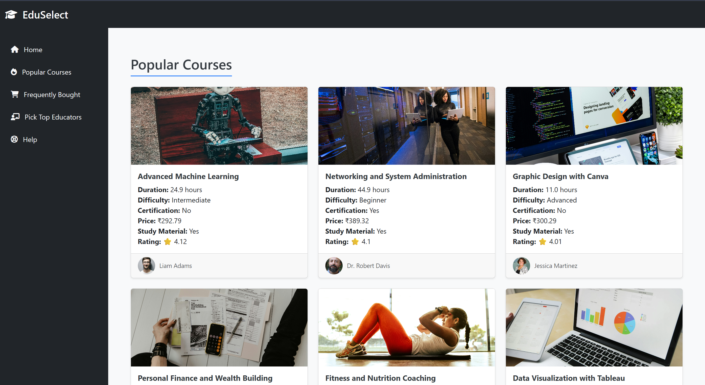
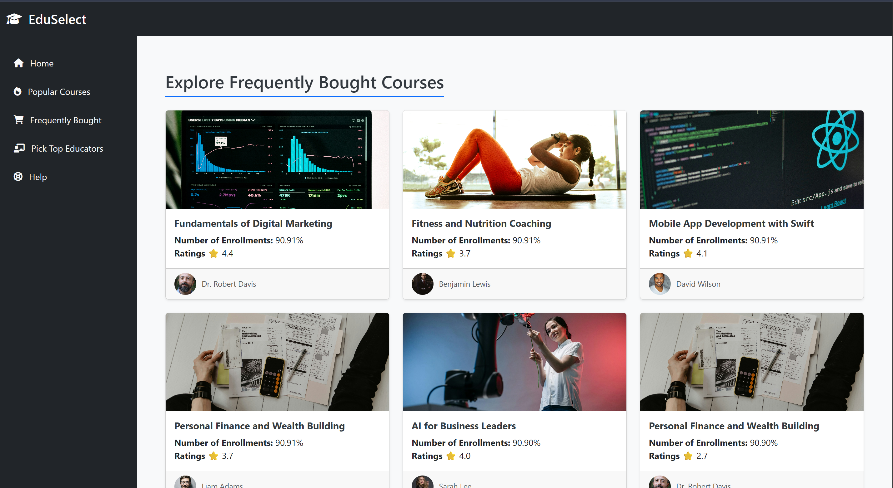
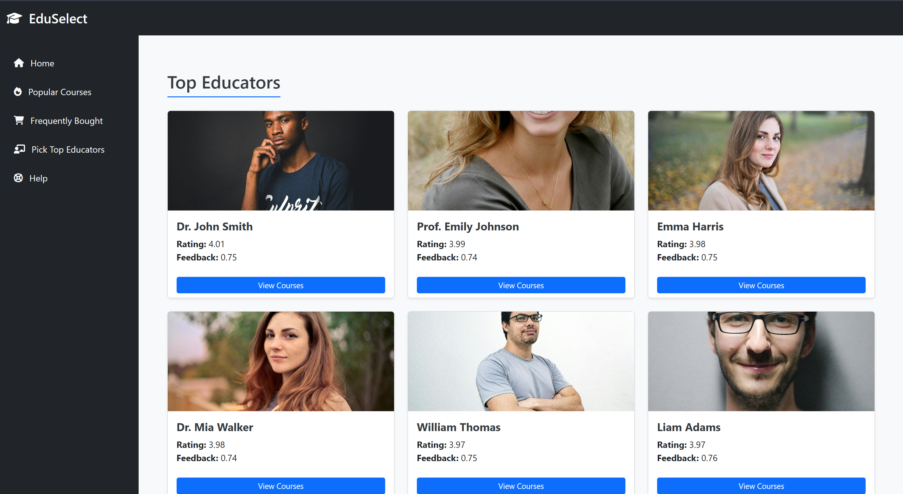
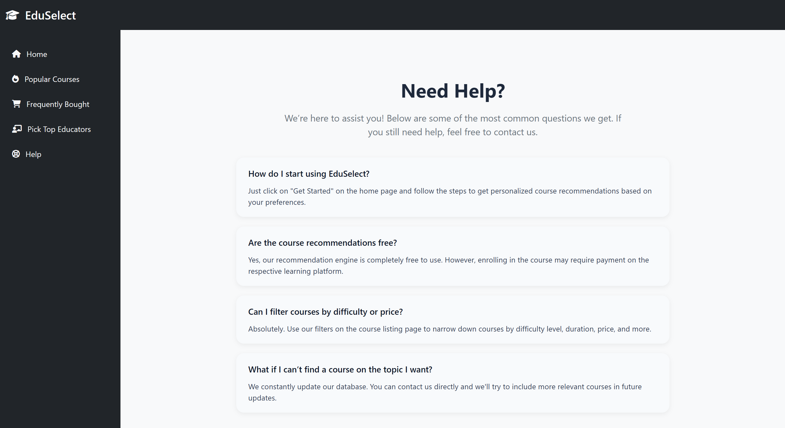

# 📚 Course Recommendation System

A comprehensive **Course Recommendation System** built using **Deep Learning**, featuring a complete pipeline for:
-  **Data Ingestion**
-  **Data Transformation**
-  **Model Training**
-  **Flask-based Web Deployment**

This system delivers intelligent course suggestions based on:
- 📊 **Popularity Filtering**
- 🛒 **Frequently Bought Courses**
- 🧑‍🏫 **Top Educators**
- 🤖 **Deep Learning Personalized Recommendations**

---

📝 Read the Full Story on Medium
Want the behind-the-scenes look at how this project was built?
👉 [Read the full blog here on Medium](https://medium.com/@3subratmishra1sep/course-recommendation-system-using-deep-learning-and-flask-a-full-data-science-project-8f9e8189eff8)

## 🚀 Features

- **Popularity-Based Filtering**: Displays trending and highly enrolled courses.
- **Frequently Bought Together**: Recommends courses based on user co-purchase behavior.
- **Top Educators**: Highlights courses from the most rated and reviewed instructors.
- **Deep Learning Model**: Provides personalized course suggestions using user-course interactions.
- **Interactive Flask App**: Engaging user interface to explore recommendations live.

---

## 🖼️ Application Screenshots

Here are some screenshots of the application prototype:







---

## ⚙️ Getting Started

### 🧪 Setup Instructions

1. **Clone the Repository**

```bash
git clone https://github.com/your-username/course-recommendation-system.git
cd course-recommendation-system
```
2. **Create & Activate Virtual Environment**
```bash
python -m venv venv
source venv/bin/activate  # Windows: venv\Scripts\activate
```
3. **Install Dependencies**
```bash
pip install -r requirements.txt
```
4. **Run the Application**
```bash
python main.py      # Data ingestion, transformation, and model training
python app.py       # Launches Flask application
```
5. **Visit the app at: http://localhost:5000**

🧠 Model Overview
Architecture: Deep Neural Network for collaborative filtering

###### Input Features: Number of enrollments, Ratings, Course duration, Certification Provided, Course Name, Instructor Name, Feedbacks
###### Output: Top-N personalized course recommendations
###### Framework: TensorFlow / Keras

🎯 Recommendation Strategies
Strategy	Based On	Purpose
⭐ Popularity Filtering	Enrollment counts	Highlights trending courses
🛍️ Frequently Bought	User purchase combinations	Suggests course bundles
🧑‍🏫 Top Educators	Instructor ratings & reviews	Promotes quality instructors
🤖 Deep Learning Model	User-course interaction matrix	Offers tailored recommendations

🛠 Tech Stack
Backend: Python, Flas
Machine Learning: TensorFlow, Keras
Data Tools: Pandas, NumPy, Scikit-learn
Visualization (optional): Matplotlib, Seaborn
Frontend: HTML, CSS

📬 Contact
Vivek Pandey
🔗 GitHub: vivekpandey1003

📄 License
This project is licensed under the MIT License.


